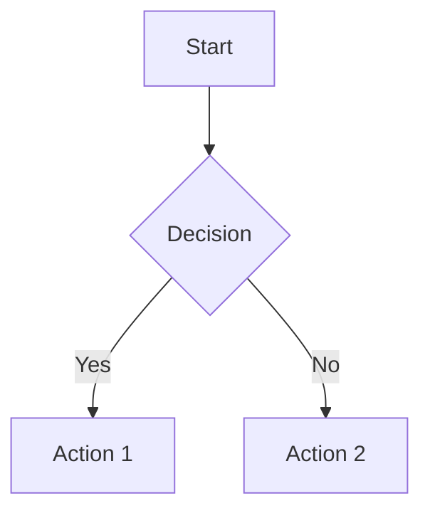

# Components Reference

This document provides a comprehensive reference for all available markdown components and features in the FusionDoc documentation system.

## Basic Components

### Admonitions
Create highlighted information boxes with different severity levels.

#### Using Code Block Syntax (v2.0+)
````markdown
```admonition
---
type: note
title: "Custom Title (Optional)"
---
The content of the admonition goes here. It can include **Markdown**.
```
````

#### Available Types
- `note` - General information
- `info` - Informational content  
- `tip` - Helpful suggestions
- `success` - Success messages
- `warning` - Important cautions
- `important` - Critical information
- `danger` - Danger warnings
- `error` - Error messages
- `bug` - Bug-related information
- `example` - Examples
- `abstract` - Abstracts or summaries
- `question` - Questions or FAQs
- `quote` - Quotes or testimonials

#### Using Colon Syntax (v1.0)
```markdown
:::note[Title]
This is a note admonition.
:::

:::tip[Title]
This is a tip admonition.
:::

:::warning[Title]
This is a warning admonition.
:::

:::danger[Title]
This is a danger admonition.
:::

:::success[Title]
This is a success admonition.
:::

:::info[Title]
This is an info admonition.
:::

### Code Blocks
Display code with syntax highlighting and optional features.

```markdown
```javascript
console.log('Hello World');
```

```python title="example.py" {1,3}
print("Line 1")
print("Line 2")
print("Line 3")
```
```

### Inline Code
Highlight inline code snippets.

```markdown
Use `npm install` to install dependencies.
```

### Mermaid Diagrams
Create various types of diagrams using Mermaid syntax.

```markdown

```

## Interactive Components

### Accordion
Create collapsible content sections.

```markdown
<Accordion title="Section 1">
Content for section 1
</Accordion>

<Accordion title="Section 2">
Content for section 2
</Accordion>
```

### Tabs
Display content in tabbed interfaces.

```markdown
<TabbedCodeBlock>
```javascript tab="JavaScript"
console.log('Hello from JS');
```

```python tab="Python"
print('Hello from Python')
```
</TabbedCodeBlock>
```

### Quiz
Create interactive quizzes with multiple choice questions.

```markdown
<Quiz>
{
  "question": "What is React?",
  "options": [
    "A JavaScript library for building UIs",
    "A database",
    "A CSS framework",
    "A server technology"
  ],
  "correct": 0,
  "explanation": "React is a JavaScript library for building user interfaces."
}
</Quiz>
```

### API Explorer
Interactive API documentation with testing capabilities.

```markdown
<ApiExplorer>
{
  "endpoint": "https://api.example.com/users",
  "method": "GET",
  "headers": {
    "Content-Type": "application/json"
  }
}
</ApiExplorer>
```

### Live Code Editor
Embed executable code snippets.

```markdown
<LiveCodeEmbed language="javascript">
console.log('Hello World');
</LiveCodeEmbed>
```

## Content Components

### Steps
Create numbered step-by-step instructions.

```markdown
<Steps>
1. First step content
2. Second step content
3. Third step content
</Steps>
```

### Timeline
Display chronological events.

```markdown
<Timeline>
- **2023** - Project started
- **2024** - First release
- **2025** - Major update
</Timeline>
```

### Cards
Display content in card format.

```markdown
<Cards>
- **Card Title 1**
  Card description 1
- **Card Title 2**
  Card description 2
</Cards>
```

### Feature Lists
Highlight product or service features.

```markdown
<FeatureList>
- **Feature 1** - Description of feature 1
- **Feature 2** - Description of feature 2
- **Feature 3** - Description of feature 3
</FeatureList>
```

### Comparison Tables
Compare different options or features.

```markdown
<ComparisonTable>
| Feature | Option A | Option B |
|---------|----------|----------|
| Price   | $10      | $20      |
| Support | Basic    | Premium  |
</ComparisonTable>
```

## Media Components

### Video Embeds
Embed videos from various platforms.

```markdown
<VideoEmbed src="https://www.youtube.com/watch?v=dQw4w9WgXcQ" />
```

### Image Gallery
Create responsive image galleries.

```markdown
<ImageGallery>


</ImageGallery>
```

### Image with Lightbox
Display images with lightbox functionality.

```markdown
{lightbox=true}
```

### Carousel
Create image or content carousels.

```markdown
<Carousel>


</Carousel>
```

## Data Visualization

### Charts
Create various types of charts.

```markdown
<Charts type="bar" data='{"labels":["Jan","Feb","Mar"],"datasets":[{"data":[10,20,30]}]}' />
```

### Stat Cards
Display statistics in card format.

```markdown
<StatCards>
- **1000** - Total Users
- **99.9%** - Uptime
- **4.8/5** - Rating
</StatCards>
```

## Layout Components

### Grid
Create responsive grid layouts.

```markdown
<Grid cols="3">
<div>Column 1 content</div>
<div>Column 2 content</div>
<div>Column 3 content</div>
</Grid>
```

### Hero Section
Create prominent header sections.

```markdown
<HeroSection>
# Welcome to Our Documentation

Get started with our comprehensive guides and tutorials.

[Get Started](/getting-started) [Learn More](/tutorial)
</HeroSection>
```

### Team Profiles
Display team member information.

```markdown
<TeamProfile>
- **John Doe** - Lead Developer
  
  john@example.com
- **Jane Smith** - Designer
  
  jane@example.com
</TeamProfile>
```

### File Tree
Display directory structures.

```markdown
<FileTree>
src/
├── components/
│   ├── Header.tsx
│   └── Footer.tsx
├── pages/
│   └── index.tsx
└── config.json
</FileTree>
```

## Advanced Features

### Scrollytelling
Create scroll-driven narratives.

```markdown
<Scrollytelling>
## Section 1
Content that appears on scroll

## Section 2
More content as user scrolls
</Scrollytelling>
```

### Tutorial Slider
Step-by-step tutorial interface.

```markdown
<TutorialSlider>
### Step 1: Setup
Install the required dependencies

### Step 2: Configuration
Configure your settings

### Step 3: Usage
Start using the application
</TutorialSlider>
```

### Animate
Add animations to content.

```markdown
<Animate type="fadeIn" delay="0.5s">
This content will fade in with a 0.5s delay
</Animate>
```

### Nested Markdown
Include external markdown files.

```markdownn<NestedMarkdown src="./includes/warning.md" />
```

### REST Client
Interactive REST API client for making HTTP requests directly from documentation.

````markdown
```rest-client
---
method: "GET"
url: "https://jsonplaceholder.typicode.com/posts/1"
headers:
  Content-Type: "application/json"
body: ""
---
```
````

### API Explorer
Interactive API documentation with endpoint testing capabilities.

````markdown
```api-explorer
---
baseUrl: "https://jsonplaceholder.typicode.com"
endpoints:
  - path: "/posts/{id}"
    method: "GET"
    title: "Get Post by ID"
    description: "Retrieves a single post by its ID."
    parameters:
      - name: "id"
        in: "path"
        description: "The ID of the post to retrieve."
        required: true
        schema:
          type: "integer"
          example: 1
---
```
````

## CTA Components

### Call-to-Action
Create action-oriented buttons and sections.

```markdown
<CTA>
## Ready to get started?

Start building your documentation today.

[Get Started](/start) [View Demo](/demo)
</CTA>
```

## Additional Components

### Hero Section
Create prominent header sections with title, subtitle, and call-to-action buttons.

```markdown
<HeroSection>
# Welcome to Our Documentation

Get started with our comprehensive guides and tutorials.

[Get Started](/getting-started) [Learn More](/tutorial)
</HeroSection>
```

### Cards Component
Display content in organized card layouts.

```markdown
<Cards>
- **Card Title 1**
  Card description 1
- **Card Title 2** 
  Card description 2
</Cards>
```

### CTA Component
Create call-to-action sections with buttons and promotional content.

```markdown
<CTA>
## Ready to get started?

Start building your documentation today.

[Get Started](/start) [View Demo](/demo)
</CTA>
```

### File Tree
Display directory and file structures in a tree format.

```markdown
<FileTree>
src/
├── components/
│   ├── Header.tsx
│   └── Footer.tsx
├── pages/
│   └── index.tsx
└── config.json
</FileTree>
```

### Steps Component
Create numbered step-by-step instructions.

```markdown
<Steps>
1. First step content
2. Second step content  
3. Third step content
</Steps>
```

### Timeline Component
Display chronological events or progress.

```markdown
<Timeline>
- **2023** - Project started
- **2024** - First release
- **2025** - Major update
</Timeline>
```

### Feature List
Highlight product or service features with descriptions.

```markdown
<FeatureList>
- **Feature 1** - Description of feature 1
- **Feature 2** - Description of feature 2
- **Feature 3** - Description of feature 3
</FeatureList>
```

### Comparison Table
Compare different options or features side by side.

```markdown
<ComparisonTable>
| Feature | Option A | Option B |
|---------|----------|----------|
| Price   | $10      | $20      |
| Support | Basic    | Premium  |
</ComparisonTable>
```

### Stat Cards
Display statistics and metrics in card format.

```markdown
<StatCards>
- **1000** - Total Users
- **99.9%** - Uptime
- **4.8/5** - Rating
</StatCards>
```

### Video Embed
Embed videos from various platforms with responsive design.

```markdown
<VideoEmbed src="https://www.youtube.com/watch?v=dQw4w9WgXcQ" />
```

### Image Gallery
Create responsive image galleries with lightbox functionality.

```markdown
<ImageGallery>


</ImageGallery>
```

### Carousel
Create rotating image or content carousels.

```markdown
<Carousel>


</Carousel>
```

### Charts
Display data visualization with various chart types.

```markdown
<Charts type="bar" data='{"labels":["Jan","Feb","Mar"],"datasets":[{"data":[10,20,30]}]}' />
```

### Grid
Create responsive grid layouts for content organization.

```markdown
<Grid cols="3">
<div>Column 1 content</div>
<div>Column 2 content</div>
<div>Column 3 content</div>
</Grid>
```

### Team Profile
Display team member information with photos and contact details.

```markdown
<TeamProfile>
- **John Doe** - Lead Developer
  
  john@example.com
- **Jane Smith** - Designer
  
  jane@example.com
</TeamProfile>
```

### Animate
Add animation effects to content elements.

```markdown
<Animate type="fadeIn" delay="0.5s">
This content will fade in with a 0.5s delay
</Animate>
```

### Scrollytelling
Create scroll-driven narrative experiences.

```markdown
<Scrollytelling>
## Section 1
Content that appears on scroll

## Section 2
More content as user scrolls
</Scrollytelling>
```

### Tutorial Slider
Create step-by-step tutorial interfaces with navigation.

```markdown
<TutorialSlider>
### Step 1: Setup
Install the required dependencies

### Step 2: Configuration
Configure your settings

### Step 3: Usage
Start using the application
</TutorialSlider>
```

### Nested Markdown
Include external markdown files within your content.

```markdown
<NestedMarkdown src="./includes/warning.md" />
```

### Live Code Embed
Embed executable code snippets with live preview.

```markdown
<LiveCodeEmbed language="javascript">
console.log('Hello World');
</LiveCodeEmbed>
```

### Tabbed Code Block
Display multiple code examples in tabbed format.

```markdown
<TabbedCodeBlock>
```javascript tab="JavaScript"
console.log('Hello from JS');
```

```python tab="Python"
print('Hello from Python')
```
</TabbedCodeBlock>
```

## AI Integration Features

FusionDoc includes several AI-powered features that require a Google Gemini API key. These features appear as a floating action bar in the bottom-right corner of each content page.

### Available AI Features

- **Chat with Document**: Interactive chat interface that answers questions based solely on the current page content
- **Generate AI Quiz**: Automatically creates quizzes with open-ended questions and provides grading with feedback
- **Generate Glossary**: Scans the document to identify key terms and generates definitions based on context
- **Generate Summary**: Creates concise bullet-point summaries of the entire page
- **Simplify Concept**: Identifies complex concepts and explains them in simple terms with analogies
- **Analyze Code**: Allows selection of code blocks for explanation or translation to other programming languages
- **AI Podcast Generator**: Transforms document content into audio podcasts with single-narrator or dialogue formats

### Configuration
To enable AI features, add your Gemini API key in the Settings panel.

### Utility Components

#### Image with Lightbox
Display images that can be opened in a full-screen lightbox.

```markdown
{lightbox=true}
```

#### Copy Button
Code blocks automatically include copy functionality, but you can also add copy buttons to other elements.

#### Tooltip
Hover tooltips are automatically added to various UI elements for better user experience.

#### Settings Drawer
The settings drawer provides configuration options for:
- Theme switching (light/dark mode)
- Language selection
- Version switching
- AI API key configuration

#### Search Functionality
Full-text search is available across all documentation with:
- Real-time search results
- Keyboard shortcuts
- Fuzzy matching
- Highlighted search terms

#### Navigation Components
- **Header**: Main navigation with logo, search, and settings
- **Sidebar**: Table of contents with collapsible sections
- **Right Sidebar**: Page navigation and related links
- **Breadcrumbs**: Hierarchical navigation path
- **Page Navigation**: Previous/next page navigation

## Configuration Options

Many components support additional configuration through frontmatter or props:

- **Colors**: Custom color schemes
- **Sizes**: Adjustable component sizes  
- **Animations**: Various animation effects
- **Responsive**: Mobile-friendly layouts
- **Accessibility**: ARIA labels and keyboard navigation

## Error Handling

Components include built-in error handling with user-friendly messages:

- Missing required attributes
- Invalid data formats
- Network errors for API components
- Fallback content for failed loads

## Version Differences

### v1.0 Components
- Basic admonitions using colon syntax (`:::note`)
- Simple code blocks with basic syntax highlighting
- Basic tabs for multi-language examples
- Standard markdown features (headings, lists, tables, etc.)
- Basic image embedding
- Simple blockquotes

### v2.0 Components
- Enhanced admonitions with code block syntax (```admonition)
- Advanced AI features (Chat, Quiz, Glossary, Summary, Simplifier, Code Analyzer, Podcast)
- Interactive components (API Explorer, Live Code Editor, Quiz, REST Client)
- Enhanced media components (Video Embed, Image Gallery, Carousel)
- Advanced layout components (Grid, Hero Section, Team Profile)
- Interactive storytelling (Scrollytelling, Tutorial Slider)
- Animation support (Animate component)
- Improved styling and responsiveness
- Lightbox functionality for images
- File tree visualization
- Timeline and step components
- Feature lists and comparison tables
- Stat cards for metrics display
- Charts and data visualization
- Nested markdown support
- Tabbed code blocks
- Enhanced search functionality
- Multi-language support
- Version switching capabilities
- Utility components (Copy Button, Tooltip, Settings Drawer)
- Navigation components (Header, Sidebar, Right Sidebar, Breadcrumbs, Page Navigation)

## Best Practices

### Component Usage Guidelines

1. **Choose appropriate components**: Select components that enhance content understanding
2. **Maintain consistency**: Use similar components for similar content types
3. **Optimize for mobile**: Test components on mobile devices
4. **Accessibility first**: Ensure all components are keyboard navigable
5. **Performance matters**: Don't overload pages with too many interactive components

### Content Organization

1. **Logical grouping**: Group related components together
2. **Clear hierarchy**: Use headings and structure effectively
3. **Progressive enhancement**: Start with basic markdown, add components as needed
4. **User experience**: Consider the reader's journey through your documentation