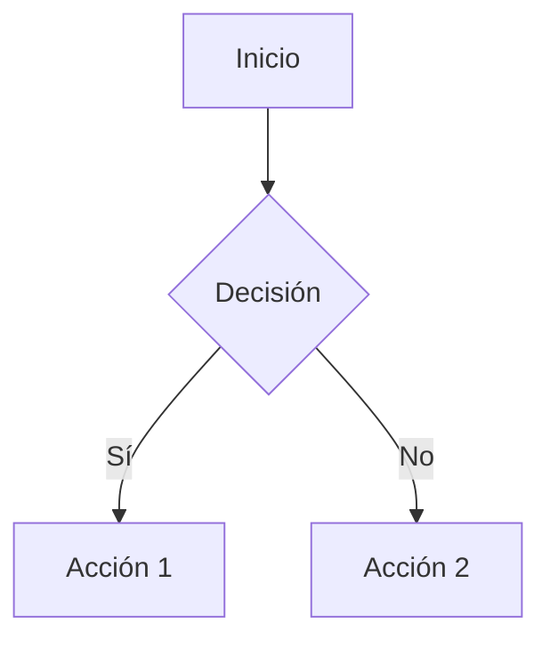

# Referencia de Componentes

Este documento proporciona una referencia completa de todos los componentes markdown y características disponibles en el sistema de documentación FusionDoc.

## Componentes Básicos

### Admoniciones
Crear cajas de información destacadas con diferentes niveles de severidad.

#### Usando Sintaxis de Bloque de Código (v2.0+)
````markdown
```admonition
---
type: note
title: "Título Personalizado (Opcional)"
---
El contenido de la admonición va aquí. Puede incluir **Markdown**.
```
````

#### Tipos Disponibles
- `note` - Información general
- `info` - Contenido informativo  
- `tip` - Sugerencias útiles
- `success` - Mensajes de éxito
- `warning` - Advertencias importantes
- `important` - Información crítica
- `danger` - Advertencias de peligro
- `error` - Mensajes de error
- `bug` - Información relacionada con errores
- `example` - Ejemplos
- `abstract` - Resúmenes o abstracts
- `question` - Preguntas o FAQs
- `quote` - Citas o testimonios

#### Usando Sintaxis de Dos Puntos (v1.0)
```markdown
:::note[Título]
Esta es una admonición de nota.
:::

:::tip[Título]
Esta es una admonición de consejo.
:::

:::warning[Título]
Esta es una admonición de advertencia.
:::

:::danger[Título]
Esta es una admonición de peligro.
:::

:::success[Título]
Esta es una admonición de éxito.
:::

:::info[Título]
Esta es una admonición de información.
:::

### Bloques de Código
Mostrar código con resaltado de sintaxis y características opcionales.

```markdown
```javascript
console.log('Hola Mundo');
```

```python title="ejemplo.py" {1,3}
print("Línea 1")
print("Línea 2")
print("Línea 3")
```
```

### Código en Línea
Resaltar fragmentos de código en línea.

```markdown
Usa `npm install` para instalar dependencias.
```

### Diagramas Mermaid
Crear varios tipos de diagramas usando sintaxis Mermaid.

```markdown

```

## Componentes Interactivos

### Acordeón
Crear secciones de contenido plegables.

```markdown
<Accordion title="Sección 1">
Contenido para la sección 1
</Accordion>

<Accordion title="Sección 2">
Contenido para la sección 2
</Accordion>
```

### Pestañas
Mostrar contenido en interfaces con pestañas.

```markdown
<TabbedCodeBlock>
```javascript tab="JavaScript"
console.log('Hola desde JS');
```

```python tab="Python"
print('Hola desde Python')
```
</TabbedCodeBlock>
```

### Cuestionario
Crear cuestionarios interactivos con preguntas de opción múltiple.

```markdown
<Quiz>
{
  "question": "¿Qué es React?",
  "options": [
    "Una biblioteca JavaScript para construir interfaces de usuario",
    "Una base de datos",
    "Un framework CSS",
    "Una tecnología de servidor"
  ],
  "correct": 0,
  "explanation": "React es una biblioteca JavaScript para construir interfaces de usuario."
}
</Quiz>
```

### Explorador de API
Documentación interactiva de API con capacidades de prueba.

```markdown
<ApiExplorer>
{
  "endpoint": "https://api.ejemplo.com/usuarios",
  "method": "GET",
  "headers": {
    "Content-Type": "application/json"
  }
}
</ApiExplorer>
```

### Editor de Código en Vivo
Incrustar fragmentos de código ejecutables.

```markdown
<LiveCodeEmbed language="javascript">
console.log('Hola Mundo');
</LiveCodeEmbed>
```

## Componentes de Contenido

### Pasos
Crear instrucciones numeradas paso a paso.

```markdown
<Steps>
1. Contenido del primer paso
2. Contenido del segundo paso
3. Contenido del tercer paso
</Steps>
```

### Línea de Tiempo
Mostrar eventos cronológicos.

```markdown
<Timeline>
- **2023** - Proyecto iniciado
- **2024** - Primera versión
- **2025** - Actualización mayor
</Timeline>
```

### Tarjetas
Mostrar contenido en formato de tarjeta.

```markdown
<Cards>
- **Título de Tarjeta 1**
  Descripción de la tarjeta 1
- **Título de Tarjeta 2**
  Descripción de la tarjeta 2
</Cards>
```

### Listas de Características
Destacar características de productos o servicios.

```markdown
<FeatureList>
- **Característica 1** - Descripción de la característica 1
- **Característica 2** - Descripción de la característica 2
- **Característica 3** - Descripción de la característica 3
</FeatureList>
```

### Tablas de Comparación
Comparar diferentes opciones o características.

```markdown
<ComparisonTable>
| Característica | Opción A | Opción B |
|---------|----------|----------|
| Precio   | $10      | $20      |
| Soporte | Básico    | Premium  |
</ComparisonTable>
```

## Componentes de Medios

### Inserción de Video
Incrustar videos de varias plataformas.

```markdown
<VideoEmbed src="https://www.youtube.com/watch?v=dQw4w9WgXcQ" />
```

### Galería de Imágenes
Crear galerías de imágenes responsivas.

```markdown
<ImageGallery>


</ImageGallery>
```

### Imagen con Lightbox
Mostrar imágenes con funcionalidad de lightbox.

```markdown
{lightbox=true}
```

### Carrusel
Crear carruseles de imágenes o contenido.

```markdown
<Carousel>


</Carousel>
```

## Visualización de Datos

### Gráficos
Crear varios tipos de gráficos.

```markdown
<Charts type="bar" data='{"labels":["Ene","Feb","Mar"],"datasets":[{"data":[10,20,30]}]}' />
```

### Tarjetas de Estadísticas
Mostrar estadísticas en formato de tarjeta.

```markdown
<StatCards>
- **1000** - Usuarios Totales
- **99.9%** - Tiempo de Actividad
- **4.8/5** - Calificación
</StatCards>
```

## Componentes de Diseño

### Cuadrícula
Crear diseños de cuadrícula responsivos.

```markdown
<Grid cols="3">
<div>Contenido columna 1</div>
<div>Contenido columna 2</div>
<div>Contenido columna 3</div>
</Grid>
```

### Sección Hero
Crear secciones de encabezado prominentes.

```markdown
<HeroSection>
# Bienvenido a Nuestra Documentación

Comienza con nuestras guías y tutoriales completos.

[Comenzar](/getting-started) [Más Información](/tutorial)
</HeroSection>
```

### Perfiles de Equipo
Mostrar información de miembros del equipo.

```markdown
<TeamProfile>
- **Juan Pérez** - Desarrollador Principal
  
  juan@ejemplo.com
- **María García** - Diseñadora
  
  maria@ejemplo.com
</TeamProfile>
```

### Árbol de Archivos
Mostrar estructuras de directorios.

```markdown
<FileTree>
src/
├── components/
│   ├── Header.tsx
│   └── Footer.tsx
├── pages/
│   └── index.tsx
└── config.json
</FileTree>
```

## Características Avanzadas

### Narrativa con Scroll
Crear narrativas impulsadas por scroll.

```markdown
<Scrollytelling>
## Sección 1
Contenido que aparece al hacer scroll

## Sección 2
Más contenido mientras el usuario hace scroll
</Scrollytelling>
```

### Control Deslizante de Tutorial
Interfaz de tutorial paso a paso.

```markdown
<TutorialSlider>
### Paso 1: Configuración
Instala las dependencias requeridas

### Paso 2: Configuración
Configura tus ajustes

### Paso 3: Uso
Comienza a usar la aplicación
</TutorialSlider>
```

### Animar
Agregar animaciones al contenido.

```markdown
<Animate type="fadeIn" delay="0.5s">
Este contenido aparecerá con desvanecimiento con un retraso de 0.5s
</Animate>
```

### Markdown Anidado
Incluir archivos markdown externos.

```markdownn<NestedMarkdown src="./includes/advertencia.md" />
```

### Cliente REST
Cliente REST interactivo para hacer peticiones HTTP directamente desde la documentación.

````markdown
```rest-client
---
method: "GET"
url: "https://jsonplaceholder.typicode.com/posts/1"
headers:
  Content-Type: "application/json"
body: ""
---
```
````

### Explorador de API
Documentación interactiva de API con capacidades de prueba de puntos de acceso.

````markdown
```api-explorer
---
baseUrl: "https://jsonplaceholder.typicode.com"
endpoints:
  - path: "/posts/{id}"
    method: "GET"
    title: "Obtener Publicación por ID"
    description: "Recupera una sola publicación por su ID."
    parameters:
      - name: "id"
        in: "path"
        description: "El ID de la publicación a recuperar."
        required: true
        schema:
          type: "integer"
          example: 1
---
```
````

## Componentes CTA

### Llamada a la Acción
Crear botones y secciones orientados a la acción.

```markdown
<CTA>
## ¿Listo para comenzar?

Comienza a construir tu documentación hoy.

[Comenzar](/start) [Ver Demo](/demo)
</CTA>
```

## Componentes Adicionales

### Sección Hero
Crear secciones de encabezado prominentes con título, subtítulo y botones de llamada a la acción.

```markdown
<HeroSection>
# Bienvenido a Nuestra Documentación

Comienza con nuestras guías y tutoriales completos.

[Comenzar](/getting-started) [Más Información](/tutorial)
</HeroSection>
```

### Componente de Tarjetas
Mostrar contenido en diseños de tarjetas organizados.

```markdown
<Cards>
- **Título de Tarjeta 1**
  Descripción de la tarjeta 1
- **Título de Tarjeta 2** 
  Descripción de la tarjeta 2
</Cards>
```

### Componente CTA
Crear secciones de llamada a la acción con botones y contenido promocional.

```markdown
<CTA>
## ¿Listo para comenzar?

Comienza a construir tu documentación hoy.

[Comenzar](/start) [Ver Demo](/demo)
</CTA>
```

### Árbol de Archivos
Mostrar estructuras de directorios y archivos en formato de árbol.

```markdown
<FileTree>
src/
├── components/
│   ├── Header.tsx
│   └── Footer.tsx
├── pages/
│   └── index.tsx
└── config.json
</FileTree>
```

### Componente de Pasos
Crear instrucciones numeradas paso a paso.

```markdown
<Steps>
1. Contenido del primer paso
2. Contenido del segundo paso  
3. Contenido del tercer paso
</Steps>
```

### Componente de Línea de Tiempo
Mostrar eventos cronológicos o progreso.

```markdown
<Timeline>
- **2023** - Proyecto iniciado
- **2024** - Primera versión
- **2025** - Actualización mayor
</Timeline>
```

### Lista de Características
Destacar características de productos o servicios con descripciones.

```markdown
<FeatureList>
- **Característica 1** - Descripción de la característica 1
- **Característica 2** - Descripción de la característica 2
- **Característica 3** - Descripción de la característica 3
</FeatureList>
```

### Tabla de Comparación
Comparar diferentes opciones o características lado a lado.

```markdown
<ComparisonTable>
| Característica | Opción A | Opción B |
|---------|----------|----------|
| Precio   | $10      | $20      |
| Soporte | Básico    | Premium  |
</ComparisonTable>
```

### Tarjetas de Estadísticas
Mostrar estadísticas y métricas en formato de tarjeta.

```markdown
<StatCards>
- **1000** - Usuarios Totales
- **99.9%** - Tiempo de Actividad
- **4.8/5** - Calificación
</StatCards>
```

### Inserción de Video
Incrustar videos de varias plataformas con diseño responsivo.

```markdown
<VideoEmbed src="https://www.youtube.com/watch?v=dQw4w9WgXcQ" />
```

### Galería de Imágenes
Crear galerías de imágenes responsivas con funcionalidad de lightbox.

```markdown
<ImageGallery>


</ImageGallery>
```

### Carrusel
Crear carruseles de imágenes o contenido rotativo.

```markdown
<Carousel>


</Carousel>
```

### Gráficos
Mostrar visualización de datos con varios tipos de gráficos.

```markdown
<Charts type="bar" data='{"labels":["Ene","Feb","Mar"],"datasets":[{"data":[10,20,30]}]}' />
```

### Cuadrícula
Crear diseños de cuadrícula responsivos para organización de contenido.

```markdown
<Grid cols="3">
<div>Contenido columna 1</div>
<div>Contenido columna 2</div>
<div>Contenido columna 3</div>
</Grid>
```

### Perfil de Equipo
Mostrar información de miembros del equipo con fotos y detalles de contacto.

```markdown
<TeamProfile>
- **Juan Pérez** - Desarrollador Principal
  
  juan@ejemplo.com
- **María García** - Diseñadora
  
  maria@ejemplo.com
</TeamProfile>
```

### Animar
Agregar efectos de animación a elementos de contenido.

```markdown
<Animate type="fadeIn" delay="0.5s">
Este contenido aparecerá con desvanecimiento con un retraso de 0.5s
</Animate>
```

### Narrativa con Scroll
Crear experiencias de narrativa impulsadas por scroll.

```markdown
<Scrollytelling>
## Sección 1
Contenido que aparece al hacer scroll

## Sección 2
Más contenido mientras el usuario hace scroll
</Scrollytelling>
```

### Control Deslizante de Tutorial
Crear interfaces de tutorial paso a paso con navegación.

```markdown
<TutorialSlider>
### Paso 1: Configuración
Instala las dependencias requeridas

### Paso 2: Configuración
Configura tus ajustes

### Paso 3: Uso
Comienza a usar la aplicación
</TutorialSlider>
```

### Markdown Anidado
Incluir archivos markdown externos dentro de tu contenido.

```markdown
<NestedMarkdown src="./includes/advertencia.md" />
```

### Editor de Código en Vivo
Incrustar fragmentos de código ejecutables con vista previa en vivo.

```markdown
<LiveCodeEmbed language="javascript">
console.log('Hola Mundo');
</LiveCodeEmbed>
```

### Bloque de Código con Pestañas
Mostrar múltiples ejemplos de código en formato con pestañas.

```markdown
<TabbedCodeBlock>
```javascript tab="JavaScript"
console.log('Hola desde JS');
```

```python tab="Python"
print('Hola desde Python')
```
</TabbedCodeBlock>
```

## Características de Integración de IA

FusionDoc incluye varias características impulsadas por IA que requieren una clave API de Google Gemini. Estas características aparecen como una barra de acción flotante en la esquina inferior derecha de cada página de contenido.

### Características de IA Disponibles

- **Chatear con el Documento**: Interfaz de chat interactivo que responde preguntas basadas únicamente en el contenido de la página actual
- **Generar Cuestionario IA**: Crea automáticamente cuestionarios con preguntas abiertas y proporciona calificación con retroalimentación
- **Generar Glosario**: Escanea el documento para identificar términos clave y genera definiciones basadas en el contexto
- **Generar Resumen**: Crea resúmenes concisos con viñetas de toda la página
- **Simplificar Concepto**: Identifica conceptos complejos y los explica en términos simples con analogías
- **Analizar Código**: Permite seleccionar bloques de código para explicación o traducción a otros lenguajes de programación
- **Generador de Podcast IA**: Transforma el contenido del documento en podcasts de audio con formatos de narrador único o diálogo

### Configuración
Para habilitar las características de IA, agrega tu clave API de Gemini en el panel de Configuración.

### Componentes de Utilidad

#### Imagen con Lightbox
Mostrar imágenes que se pueden abrir en un lightbox de pantalla completa.

```markdown
{lightbox=true}
```

#### Botón de Copiar
Los bloques de código incluyen funcionalidad de copia automáticamente, pero también puedes agregar botones de copia a otros elementos.

#### Información Emergente
Se agregan tooltips al pasar el mouse a varios elementos de la interfaz de usuario para una mejor experiencia de usuario.

#### Panel de Configuración
El panel de configuración proporciona opciones de configuración para:
- Cambio de tema (modo claro/oscuro)
- Selección de idioma
- Cambio de versión
- Configuración de clave API de IA

#### Funcionalidad de Búsqueda
La búsqueda de texto completo está disponible en toda la documentación con:
- Resultados de búsqueda en tiempo real
- Atajos de teclado
- Coincidencia difusa
- Términos de búsqueda destacados

#### Componentes de Navegación
- **Encabezado**: Navegación principal con logo, búsqueda y configuración
- **Barra Lateral**: Tabla de contenidos con secciones plegables
- **Barra Lateral Derecha**: Navegación de página y enlaces relacionados
- **Migas de Pan**: Ruta de navegación jerárquica
- **Navegación de Página**: Navegación de página anterior/siguiente

## Opciones de Configuración

Muchos componentes soportan configuración adicional a través de frontmatter o props:

- **Colores**: Esquemas de color personalizados
- **Tamaños**: Tamaños de componentes ajustables  
- **Animaciones**: Varios efectos de animación
- **Responsivo**: Diseños amigables para móviles
- **Accesibilidad**: Etiquetas ARIA y navegación por teclado

## Manejo de Errores

Los componentes incluyen manejo de errores integrado con mensajes amigables para el usuario:

- Atributos requeridos faltantes
- Formatos de datos inválidos
- Errores de red para componentes de API
- Contenido de respaldo para cargas fallidas

## Diferencias de Versión

### Componentes v1.0
- Admoniciones básicas usando sintaxis de dos puntos (`:::note`)
- Bloques de código simples con resaltado básico de sintaxis
- Pestañas básicas para ejemplos multi-idioma
- Características estándar de markdown (encabezados, listas, tablas, etc.)
- Inserción básica de imágenes
- Citas simples

### Componentes v2.0
- Admoniciones mejoradas con sintaxis de bloque de código (```admonition)
- Características de IA avanzadas (Chat, Cuestionario, Glosario, Resumen, Simplificador, Analizador de Código, Podcast)
- Componentes interactivos (Explorador de API, Editor de Código en Vivo, Cuestionario, Cliente REST)
- Componentes de medios mejorados (Inserción de Video, Galería de Imágenes, Carrusel)
- Componentes de diseño avanzados (Cuadrícula, Sección Hero, Perfil de Equipo)
- Narrativa interactiva (Narrativa con Scroll, Control Deslizante de Tutorial)
- Soporte de animación (componente Animate)
- Estilos y responsividad mejorados
- Funcionalidad de lightbox para imágenes
- Visualización de árbol de archivos
- Componentes de línea de tiempo y pasos
- Listas de características y tablas de comparación
- Tarjetas de estadísticas para visualización de métricas
- Gráficos y visualización de datos
- Soporte para markdown anidado
- Bloques de código con pestañas
- Funcionalidad de búsqueda mejorada
- Soporte multi-idioma
- Capacidades de cambio de versión
- Componentes de utilidad (Botón de Copiar, Información Emergente, Panel de Configuración)
- Componentes de navegación (Encabezado, Barra Lateral, Barra Lateral Derecha, Migas de Pan, Navegación de Página)

## Mejores Prácticas

### Guías de Uso de Componentes

1. **Elige componentes apropiados**: Selecciona componentes que mejoren la comprensión del contenido
2. **Manten consistencia**: Usa componentes similares para tipos de contenido similares
3. **Optimiza para móviles**: Prueba componentes en dispositivos móviles
4. **Accesibilidad primero**: Asegúrate de que todos los componentes sean navegables por teclado
5. **El rendimiento importa**: No sobrecargues las páginas con demasiados componentes interactivos

### Organización de Contenido

1. **Agrupación lógica**: Agrupa componentes relacionados juntos
2. **Jerarquía clara**: Usa encabezados y estructura efectivamente
3. **Mejora progresiva**: Comienza con markdown básico, agrega componentes según sea necesario
4. **Experiencia de usuario**: Considera el recorrido del lector a través de tu documentación